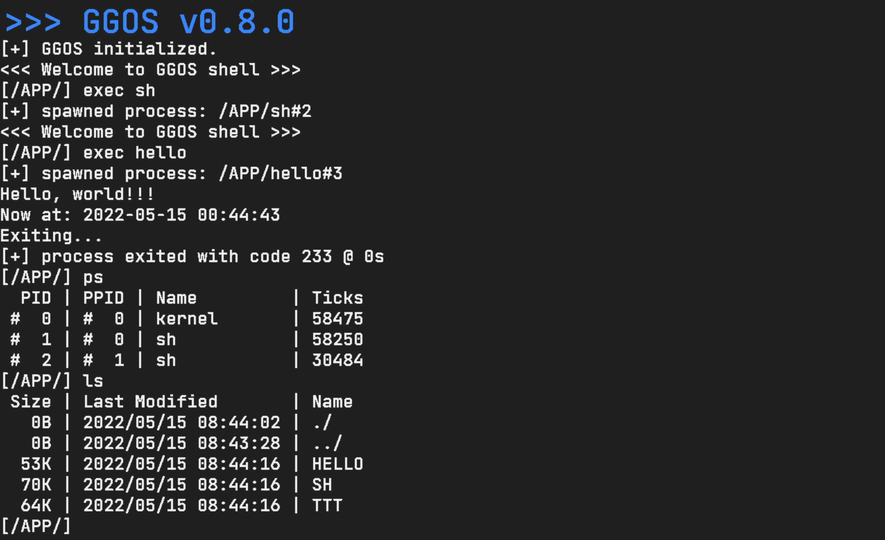
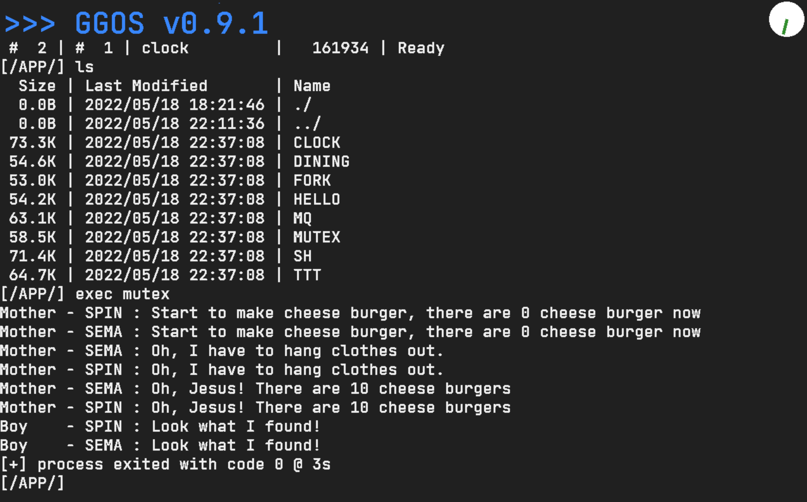
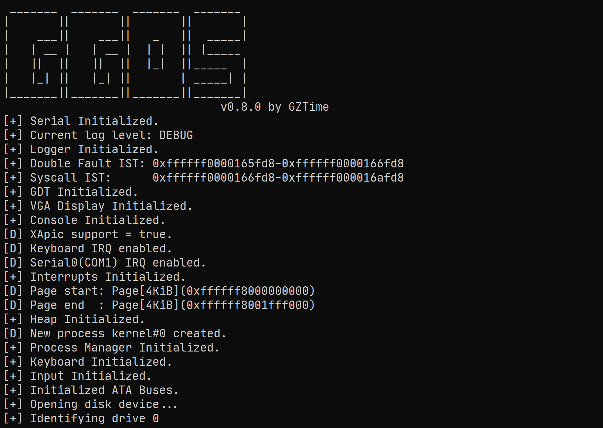
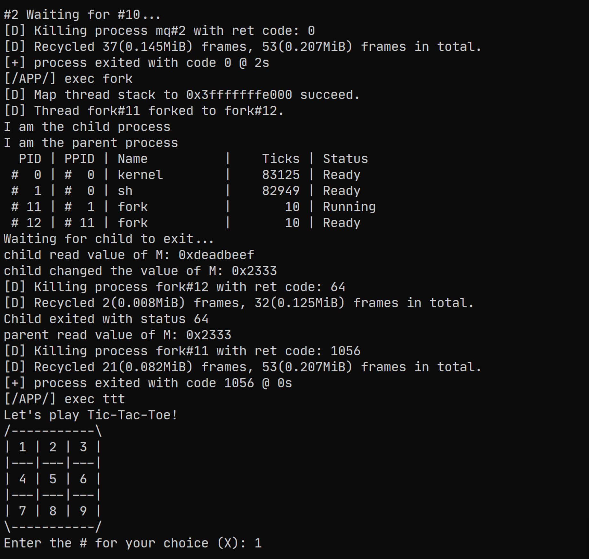

# GZTime's GG OS

OS course project.

---

The basic development of this course operating system has been completed.

Using `JetBrainsMono` as console font.

See also: [GGOS 诞生记](https://blog.gzti.me/posts/2022/2430028)

OS lab tutorial based on this project: [中山大学 YatSenOS v2 操作系统实验教程](https://ysos.gzti.me/)

## Usage

use `make run` to start the OS, or run as no-graphic mode with `make run RUN_MODE=nographic`

or you can use `python ggos.py run` to start the OS on windows / linux / macos with qemu and rust toolchain installed.

The development work is based on QEMU v7.0.0.

You can put your files to `esp` directory to read them in the OS.

## Demo

## Stargazers over time

## Reference

1. [rCore](https://github.com/rcore-os/rCore)
2. [rCore-Tutorial](https://rcore-os.github.io/rCore-Tutorial-Book-v3/index.html)
3. [Writing an OS in Rust](https://os.phil-opp.com/)
4. [rust-xos](https://github.com/xfoxfu/rust-xos)
5. [moros](https://github.com/vinc/moros)
