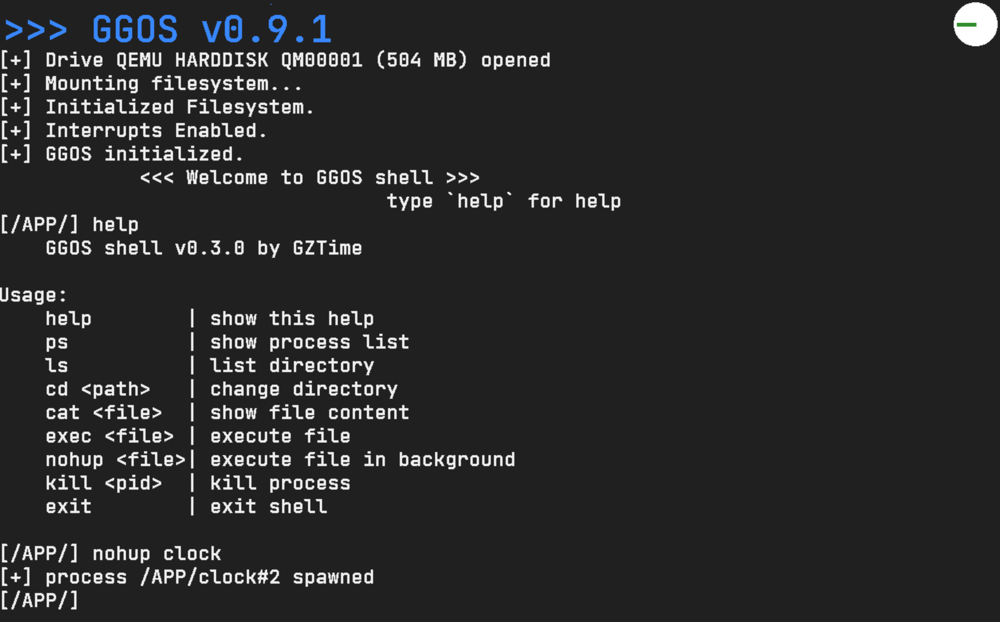
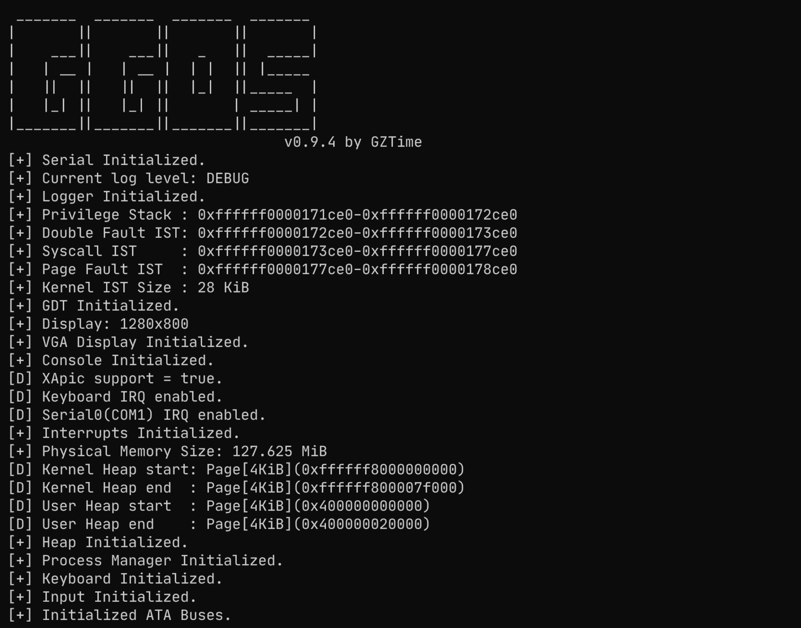
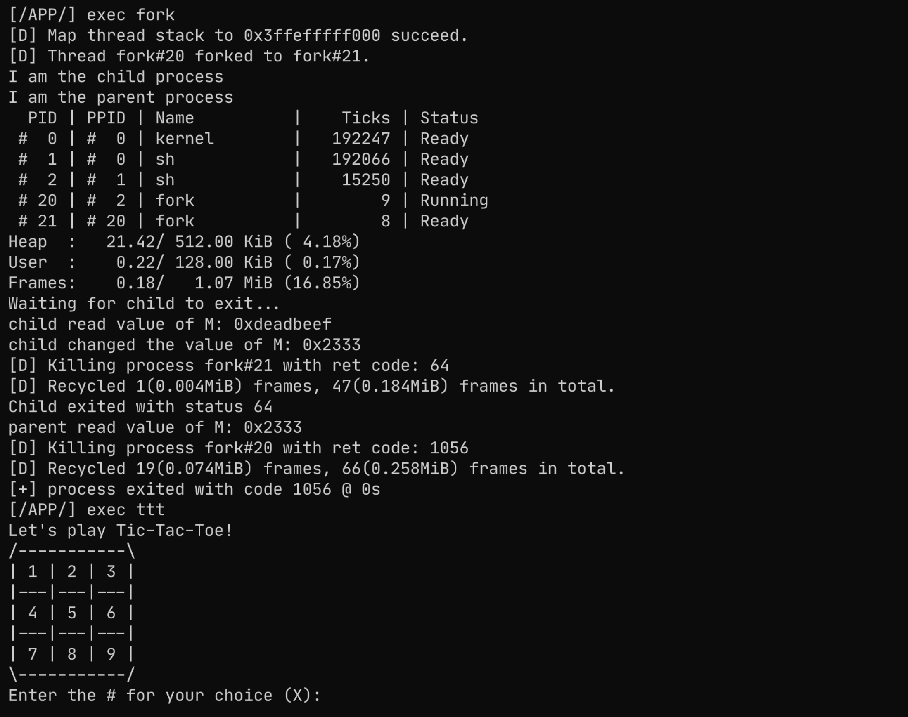

# GZTime's GG OS

OS course project.

---

The basic development of this course operating system has been completed.

Using `JetBrainsMono` as console font.

See also: [GGOS 诞生记](https://blog.gztime.cc/posts/2022/2430028)

## Usage

use `make run` to start the OS, or run as no-graphic mode with `make run RUN_MODE=nographic`

`/usr/share/ovmf/OVMF.fd` is required for booting this OS, you may need to install `ovmf` first. The development work is based on QEMU v7.0.0.

You can put your files to `esp` directory to read them in the OS.

## Demo

## Stargazers over time

## Reference

1. [rCore](https://github.com/rcore-os/rCore)
2. [rCore-Tutorial](https://rcore-os.github.io/rCore-Tutorial-Book-v3/index.html)
3. [Writing an OS in Rust](https://os.phil-opp.com/)
4. [rust-xos](https://github.com/xfoxfu/rust-xos)
5. [moros](https://github.com/vinc/moros)
